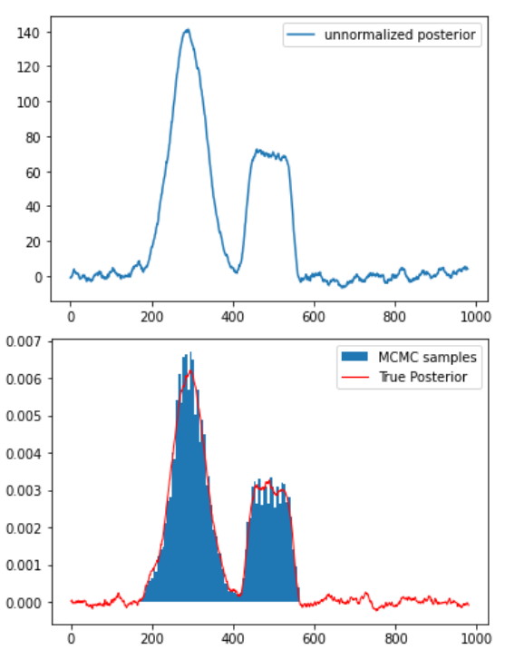

# Markov Chain Monte-Carlo demo

I didn't believe that MCMC would ever work, so I had to code it for myself. I generate a not-nice distribution (usually the posterior of some model weights in the bayesian setting), and use Metropolis-Hastings with a proposal distribution $p(x_{n+1}\vert x)=\mathcal{N}(x_{n+1}; x, 10)$.
The image below shows the normalized binned samples after 100,000 steps through the chain, with a rejection rate of 0.07.

So yeah, it works. (cool!!!)
